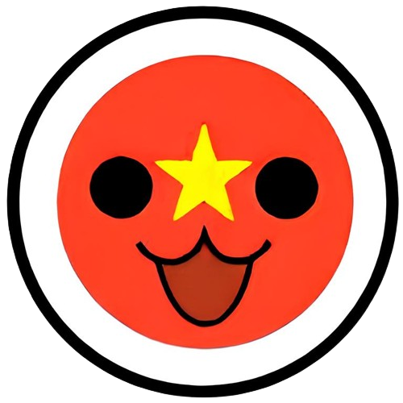

# VOT

Vietnamese <a href="https://osu.ppy.sh/" class="vot-link">osu!</a> website dedicated to Taiko mode.

## Getting Started

Go to this well-written [setup guide](doc/SETUP.md) on how to setup the development environment as quickly as you can.

## Contributing

- TODO: Get other part setup correctly first before writing this one.

## Related Projects

- [VOS-Chatbot](https://github.com/FaceWithDark/VOS-Chatbot) - A dedicated repository for chatbot development within VOS website.

## Credits

- TODO: Manually add in later if there are helps.

## License

[MIT](LICENSE) © [DeepInDark](https://github.com/FaceWithDark).
